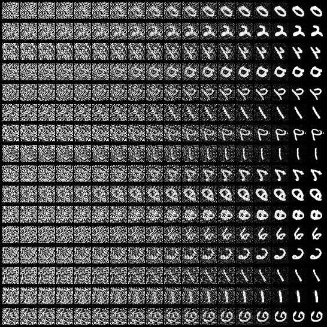
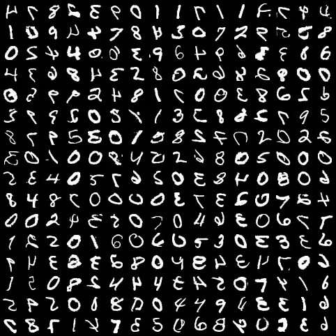
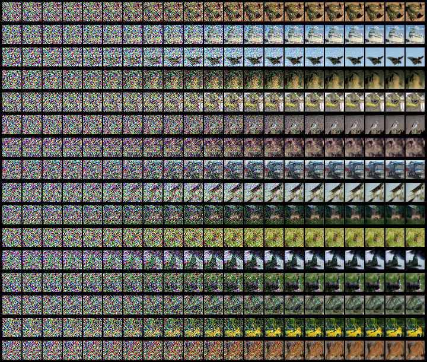
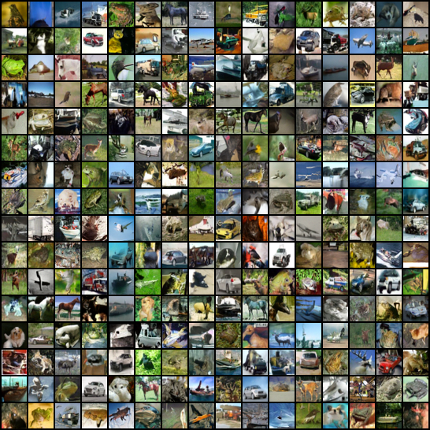

# Diffusion Models
Forked from [Denoising Diffusion Implicit Models](https://github.com/Alokia/diffusion-DDIM-pytorch) which has already implemented DDPM, DDIM, Unet and $\epsilon$-prediction, this repository implemented DPM-solver and v-predicition.
What's more, The original repository trained on MNIST and CIFAR-10, while I also trained models on [smithsonian_butterflies_subset](https://huggingface.co/datasets/huggan/smithsonian_butterflies_subset). 

The file structure is as follows:
```bash 
├─checkpoint # store checkpoint of diffusion model.
├─data 
│  ├─benchmark_result # result in the forked repository. 
│  ├─cifar-10-batches-py # the data of CIFAR-10 dataset
│  ├─MNIST # the data of MNIST dataset
│  │  └─raw
│  └─result # the new generated result
│      ├─butterflies_1000
│      ├─butterflies_2000
│      ├─butterflies_250
│      ├─butterflies_2500
│      ├─butterflies_500
│      ├─butterflies_vpred_1000
│      ├─butterflies_vpred_250
│      ├─butterflies_vpred_300
│      ├─butterflies_vpred_350
│      └─butterflies_vpred_500
├─dataset # dataset 
├─logs # the logs during training
├─model # the implementation of UNet
├─utils 
│  ├─__init__.py 
│  ├─callbacks.py
│  ├─engine.py # the most important modules: GaussianDiffusionTrainer 
               # and samplers imcluding DDPM, DDIM, DPM-solver 
│  └─tools.py 
├─config.yml # configuration of model training
├─generate.py # the generating entry
├─README.md # this file
└─train.py # the training entry
```

## Denoising Diffusion Implicit Models

This is a pytorch implementation of DDIM. The original paper is here https://arxiv.org/abs/2010.02502 .

This code is almost identical to DDPM, see here: https://github.com/Alokia/diffusion-DDPM-pytorch

## how to use

Almost all the parameters that can be modified are listed in the `config.yml` file. You can modify the relevant parameters as needed, and then run the `train.py` file to start training.

After training, run the `generate.py` file to generate the results. These are the parameters of `generate.py` :

* `-cp` : the path of checkpoint.
* `--device` : device used. `'cuda'` (default) or `'cpu'`.
* `--sampler` : sampler method, can be `'ddpm'`(default) or `'ddim'`.
* `-bs` : how many images to generate at once. Default  `16`.
* `--result_only` : whether to output only the generated results. Default  `False`.
* `--interval` : extract an image every how many steps. Only valid without the `result_only` parameter. Default  `50`.
* `--eta` : ddim parameter, $\eta$  in the paper. Default `0.0`.
* `--steps` : ddim sampling steps. Default `100`.
* `--method` : ddim sampling method. can be `'linear'`(default) or `'quadratic'`.
* `--nrow` : how many images are displayed in a row. Only valid with the `result_only` parameter. Default  `4`.
* `--show` : whether to display the result image. Default  `False`.
* `-sp` : save path of the result image. Default  `None`.
* `--to_grayscale` : convert images to grayscale. Default  `False`.

> [CAUTION]
> `V_PRED` is a global variable in the file `utils\engine.py`
> when `V_PRED = True`, it means using v-predition
> when `V_PRED = False`, it means using $\epsilon$-predition

## Some generated images

### MNIST
[click to download checkpoint](https://drive.google.com/file/d/1gwhczBWOjUtw4Fz_y2PidyKnrUsMSN8t/view?usp=drive_link)

```shell
python generate.py -cp "checkpoint/mnist.pth" -bs 16 --interval 3 --show -sp
"data/result/mnist_sampler.png" --sampler "ddim" --steps 50
```




```shell
python generate.py -cp "checkpoint/mnist.pth" -bs 256 --show -sp "data/result/mnist_result.png" --nrow 16 --result_only --sampler "ddim" --steps 50
```



### CIFAR10
[click to download checkpoint](https://drive.google.com/file/d/1GRVfLSfjGtEPJzxg52k4wj4w2TKk-utO/view?usp=drive_link)

```shell
python generate.py -cp "checkpoint/cifar10.pth" -bs 16 --interval 10 --show -sp "data/result/cifar10_sampler.png" --sampler "ddim" --steps 200 --method "quadratic"
```



```shell
python generate.py -cp "checkpoint/cifar10.pth" -bs 256 --show -sp "data/result/cifar10_result.png" --nrow 16 --result_only --sampler "ddim" --steps 200 --method "quadratic"
```




### butterflies

$\epsilon$-prediction

```shell
python generate.py -cp "checkpoint/butterflies_500.pth" -bs 8 --interval 10 --show -sp "data/result/butterflies_500/butterflies_sampler.png" --sampler "ddim" --steps 200 --method "quadratic"
```

```shell
python generate.py -cp "checkpoint/butterflies.pth" -bs 256 --show -sp "data/result/butterflies_result.png" --nrow 16 --result_only --sampler "ddim" --steps 200 --method "quadratic"
```


using DPM-solver sampler
```shell
python generate.py -cp "checkpoint/butterflies.pth" -bs 8 --interval 10 --show -sp "data/result/butterflies_2000/butterflies_sampler_dpm3_lambda0p5.png" --sampler "dpm" --solver_order 3 --steps 200 --method "quadratic"
```


v-prediction
using ddpm

```shell
python generate.py -cp "checkpoint/butterflies_vpred_1000.pth" -bs 8 --interval 10 --show -sp "data/result/butterflies_vpred_1000/butterflies_sampler_ddpm.png" --sampler "ddpm" --steps 200 --method "quadratic"
```

using ddim 
```shell
python generate.py -cp "checkpoint/butterflies_vpred_250.pth" -bs 8 --interval 10 --show -sp "data/result/butterflies_vpred_250/butterflies_sampler.png" --sampler "ddim" --steps 200 --method "quadratic"
```

```shell
python generate.py -cp "checkpoint/butterflies_vpred.pth" -bs 256 --show -sp "data/result/butterflies_vpred_500/butterflies_result.png" --nrow 16 --result_only --sampler "ddim" --steps 200 --method "quadratic"
```

using DPM-solver sampler
```shell
python generate.py -cp "checkpoint/butterflies_vpred_250.pth" -bs 8 --interval 10 --show -sp "data/result/butterflies_vpred_250/butterflies_sampler_dpm_lambda0p5.png" --sampler "dpm" --solver_order 1 --steps 200 --method "quadratic"
```

Based on my experience, training 250 ~ 500 epoches may be the most suitable. And the model trained by v-prediction is better than the model trained by $\epsilon$-predition.
There are some beautiful butterflis generated by diffusion model


